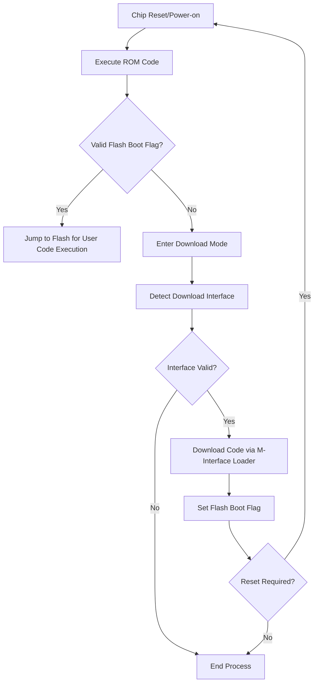
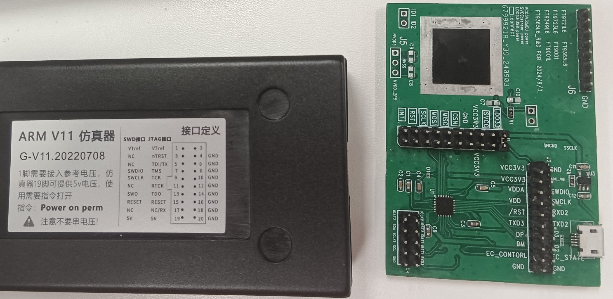
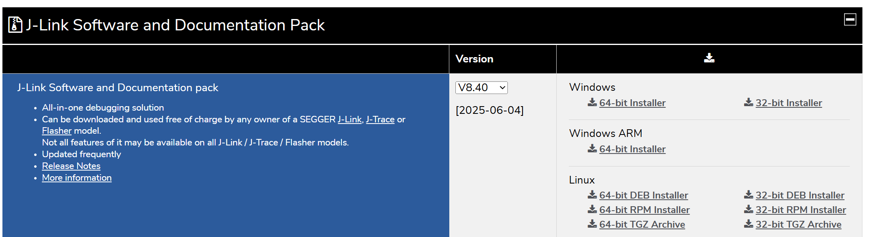
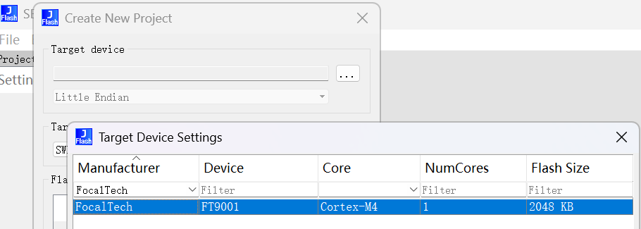
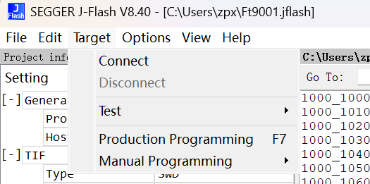

**FT9001 Programming Guide**

**Version 1.0**
**Document Number**:-

**Author**:Zhang Piaoxiang 
**Date**:2025 / 06 / 05 

**Change List**

| Version | **File Modification Description** | Author          | Date     |
| ------- | --------------------------------- | --------------- | -------- |
| 1.0     | Initial Version                   | Zhang Piaoxiang | 20250605 |

[TOC]

## **1 Introduction**

```markdown
This document provides guidelines for upgrading firmware on the FT9001 chip, covering:  
1. Development Notes: Chip boot process, hardware specifications  
2. Simulation Debugging: Flash emulation configuration  
3. Code Programming: Methods for downloading code to the chip
```

## **2 Development Notes**

### **2.1** Development Kit Contents

The customer development kit includes: 

- **Flash Map**:FT9001.xml&Device_FT9001.FLM

- **Test Firmware :zephyr.hex**

- **Programming Tools**
  
  - **JFlash Programming**: Firmware programming via JFlash.

### **2.2** Chip Boot Process



### **2.3 **Hardware Specifications

#### **2.3.1 **Development Board

Different packages correspond to different development boards. Refer to hardware documentation in the development kit.

#### **2.3.2 **Emulator Connection

Supports J-Link SW interface. Connection diagram:

| J-Link | Development Board |
|:------ |:----------------- |
| SWDIO  | SWDIO             |
| SWCLK  | SWCLK             |
| RX     | TXD2              |
| GND    | GND               |

**J-Link Pinout**:

| Pin | Function | Pin   | Function |
|:--- |:-------- |:----- |:-------- |
| 1   | VCC      | 17    | UART/RX  |
| 7   | SWDIO    | 9     | SWCLK    |
| 15  | RESET    | Other | GND      |

**Development Board Pinout**:

| Pin        | Function          | Pin  | Function                |
|:---------- |:----------------- |:---- |:----------------------- |
| VCC3V3     | 3.3V Power Supply | CSN  | SPI Master Chip Select  |
| SWDIO      | Debug Data        | MISO | SPI Master In Slave Out |
| SWCLK      | Debug Clock       | MOSI | SPI Master Out Slave In |
| RXD2       | UART2 Input       | SCK  | SPI Master Clock        |
| TXD2       | UART2 Output      | RST  | Sensor Reset Pin        |
| DP         | USB D+            | INT  | Sensor Interrupt Pin    |
| DM         | USB D-            | GND  | Ground                  |
| EC_CONTROL | Power Shielding   |      |                         |
| EC_STATE   | One-Key Power On  |      |                         |



### **2.4 **Chip Boot Modes

| Mode      | Flash Boot Flag | Description                                                               |
|:--------- |:--------------- |:------------------------------------------------------------------------- |
| **ROM**   | Invalid         | Boots from ROM on power-on/reset. Executes Loader code (factory default). |
| **Flash** | Valid           | Jumps to Flash after ROM flag check. Can be cleared via driver interface. |

## **3.Programming Firmware with JFlash on Windows**

### **3.1** Install JFlash

Download latest version:

[SEGGER - The Embedded Experts - Downloads - J-Link / J-Trace](https://www.segger.com/downloads/jlink/)



Create `JLinkDevices` directory and copy files:

```bash
Device_FT9001.FLM` and `FT9001.xml` → `C:\Users\<UserName>\AppData\Roaming\SEGGER\JLinkDevices
```


### Create Project

Select **File → New Project** → Choose FT9001 device



### **3.3**Load Firmware

**File → Open Data file** → Select compiled HEX file


### **3.4 **Program Device

Connect device → **Target → Connect** → **Production Programming**



## **4.Programming on Ubuntu 22.04**

### **4.1**Install Dependencies

copy FT9001.xml&Device_FT9001.FLM to <root>~/.config/SEGGER/JLinkDevices

```bash
sudo apt-get install libncurses6
sudo dpkg -i JLink_Linux_V840_x86_64.deb

sudo su
root@test-laptop:cd ~/.config/SEGGER/
root@test-laptop:~/.config/SEGGER# mkdir JLinkDevices
root@test-laptop:~/.config/SEGGER# cd JLinkDevices/

root@test-laptop:~/.config/SEGGER/JLinkDevices# cp $yourPath/FT9001.xml ./
root@test-laptop:~/.config/SEGGER/JLinkDevices# cp $yourPath/Device_FT9001.FLM ./


root@test-laptop:~/.config/SEGGER/JLinkDevices#cd /opt/SEGGER/JLink
root@test-laptop:/opt/SEGGER/JLink#./JFlashExe
```

### **4.2 **Configure JFlash

**File → New Project** → Select FT9001


### **4.3 **Load Firmware

**File → Open Data file** → Select HEX file


### **4.4 **Program Device

**Target → Connect** → **Production Programming**


### **4.5 **Program Device with console

The following commands can be used to perform a firmware update.

```bash
root@test-laptop:/opt/SEGGER/JLink# ./JLinkExe -autoconnect 1 -device FT9001 -if swd -speed 4000 -commandfile ~/ft9001.jlink

```

The contents of `ft9001.jlink` are as follows, **and the hex file path requires modification**.

```Script
loadfile /home/test/zephyr.hex 0x10001000
r
qc
```

or use following commands:

```bash
/opt/SEGGER/JLink/JFlashExe  -openprj /home/dawidn/Projects/Chromium/focaltech/ft9001.jflash -open /home/dawidn/chromiumos/src/platform/ec/build/zephyr/ft9001/build-ro/zephyr/zephyr.bin -relocate 0x10001000 -production -disconnect -exit
```


## **5 Firmware Verification**

### **5.1**Hardware Connection

Connect J-Link Pin 17 (RX) → Development Board TXD2


### **5.2 **Serial Configuration

```bash
test@test-laptop:/opt/SEGGER/JLink$ stty -F /dev/ttyACM0 115200 
test@test-laptop:/opt/SEGGER/JLink$ cat /dev/ttyACM0 
```

### **5.3 **Output Verification

Successful firmware output example:


